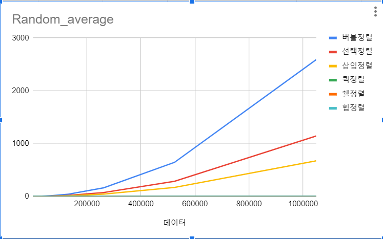
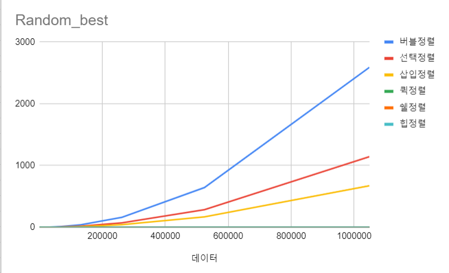
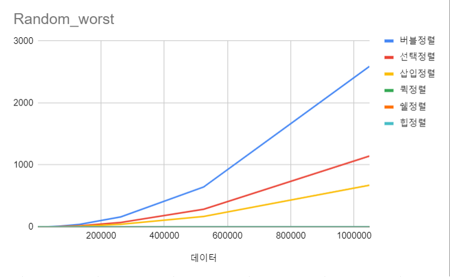
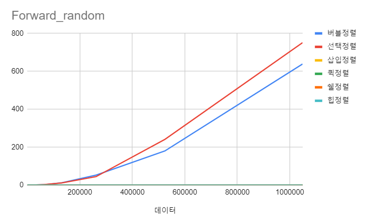
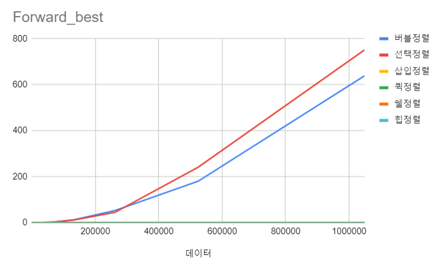
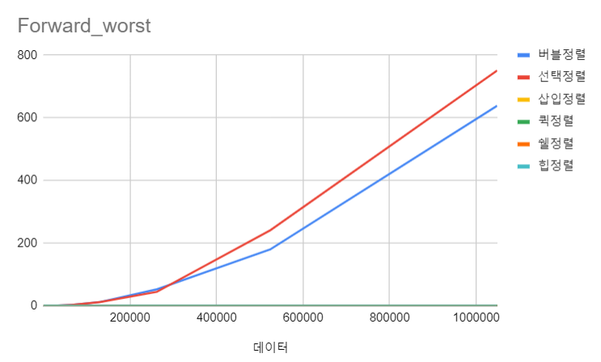
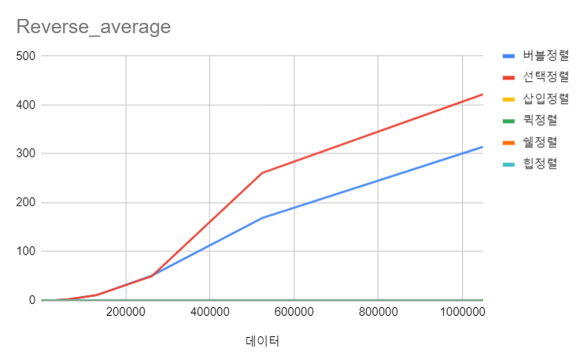
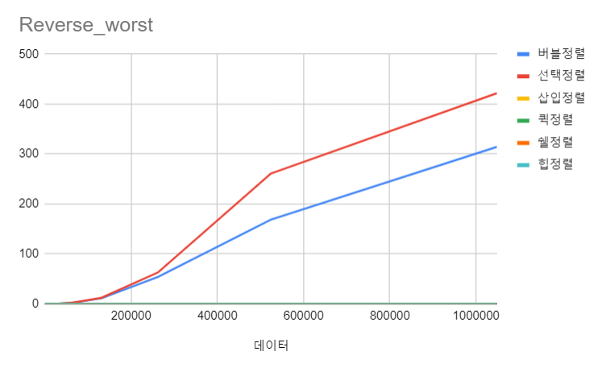

# SortAlgorithm_Time
우선, 자바는 잘 못해서 c언어로 구현해봤습니다.  
코드는 랜덤 데이터, 정렬된 데이터, 역정렬 데이터 세가지를 구현해서 올려놓았습니다.  
결과값을 2의 거듭제곱들 중 아무거나 하나인 2의 16승인 65536으로 해보고 잘 구현되는지 확인해보았습니다.  

* 랜덤 데이터  

</img>

  

* 정렬된 데이터  

</img>

  

* 역정렬 데이터  

</img>

  

이런 식으로 출력이 되는 것을 확인했고 이제 2의 거듭제곱들을 넣어서 엑셀에 적고 그래프를 그려보겠습니다.  

근데 하다보니 이런 생각이 들었습니다.  
안그래도 데이터가 많아질수록 오래걸리는데 바보같이 선택정렬을 택해서 정렬했다는 생각이 들었습니다.  
따라서 퀵, 쉘 , 힙중에 고르는게 그나마 낫겠다 싶어서 최악인 경우도 빠른 힙정렬을 골라 해야 겠다는 생각이 들어 수정했습니다.  

각 경우당 3-5번 정도 실행하였습니다.  

</img>

  

</img>

  

</img>

  

</img>

  

</img>

  

</img>

  

</img>

  

</img>

  

</img>

  

## 로그를 넣어서 계산
---
로그를 넣어 계산해보면 처음에 0이 아닌 값에서 -가 나왔다 점차 증가하는 것을 알 수 있습니다. 그래서 어느정도의 직선 꼴을 띨 것 같습니다. (제가 엑셀을 잘 못다뤄서 표 값을 다 log아래값 2를 채우는 것을 모르겠습니다...)  